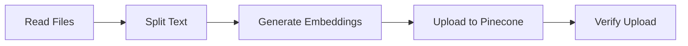
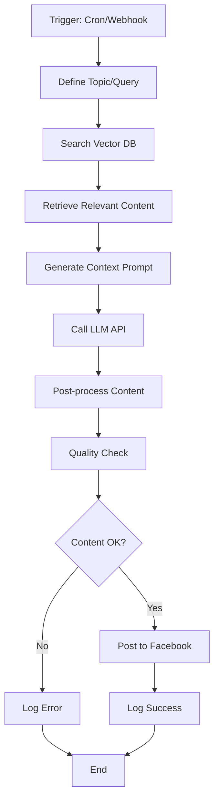
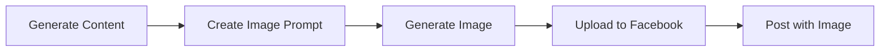
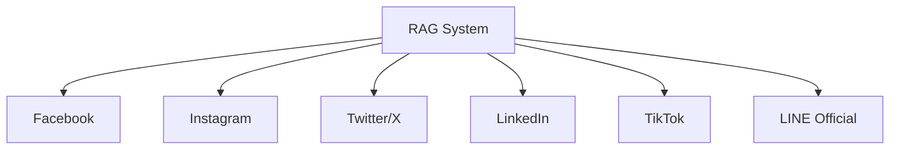

# บทเรียน: สร้าง RAG System เพื่อโพสข้อความใน Facebook ด้วย n8n
## การเรียนรู้การสร้างระบบอัตโนมัติที่ฉลาดสำหรับ Social Media


*ภาพรวมของระบบ RAG ที่เชื่อมต่อกับ Facebook ผ่าน n8n*

---

## สารบัญ

1. [บทนำและทฤษฎี](#บทนำและทฤษฎี)
2. [การเตรียมข้อมูลและ Environment](#การเตรียมข้อมูลและ-environment)
3. [การติดตั้งและตั้งค่า n8n](#การติดตั้งและตั้งค่า-n8n)
4. [การสร้าง Vector Database](#การสร้าง-vector-database)
5. [การสร้าง RAG Workflow](#การสร้าง-rag-workflow)
6. [การเชื่อมต่อ Facebook API](#การเชื่อมต่อ-facebook-api)
7. [การทดสอบและ Optimization](#การทดสอบและ-optimization)
8. [การ Deploy และ Monitoring](#การ-deploy-และ-monitoring)

---

## บทนำและทฤษฎี

### วัตถุประสงค์การเรียนรู้
- เข้าใจแนวคิด RAG (Retrieval Augmented Generation)
- สามารถใช้ n8n สร้าง automation workflow
- เชื่อมต่อ Facebook API เพื่อโพสข้อความอัตโนมัติ
- สร้างระบบที่สามารถสร้างเนื้อหาที่เกี่ยวข้องและแม่นยำ

### RAG คืออะไร?


*สถาปัตยกรรมของระบบ RAG*

**RAG (Retrieval Augmented Generation)** เป็นเทคนิคที่รวม:

1. **Retrieval System**: ค้นหาข้อมูลที่เกี่ยวข้องจากฐานข้อมูล
2. **Generation System**: สร้างข้อความใหม่จาก LLM โดยอ้างอิงข้อมูลที่ค้นหามา

**ข้อดีของ RAG:**
- **ข้อมูลทันสมัย**: ไม่จำกัดด้วยข้อมูลที่ AI เรียนรู้มา
- **ความแม่นยำสูง**: อ้างอิงข้อมูลที่เชื่อถือได้
- **ลดการ Hallucination**: AI แต่งเรื่องน้อยลง
- **Customizable**: ปรับเนื้อหาตามธุรกิจได้

### ภาพรวมของระบบที่จะสร้าง


*ภาพรวมระบบ RAG สำหรับ Facebook Posting*

**Flow การทำงาน:**
1. **Trigger**: เวลาที่กำหนด หรือ Event ที่เกิดขึ้น
2. **Data Retrieval**: ค้นหาข้อมูลจาก Vector Database
3. **Content Generation**: สร้างเนื้อหาด้วย LLM
4. **Content Review**: ตรวจสอบและปรับแต่ง
5. **Facebook Posting**: โพสขึ้น Facebook Page

---

## การเตรียมข้อมูลและ Environment

### ข้อกำหนดของระบบ

**Software Requirements:**
- Node.js 16+ 
- Docker (Optional แต่แนะนำ)
- Git
- Text Editor (VS Code แนะนำ)

**Services Required:**
- n8n Instance (Self-hosted หรือ Cloud)
- Vector Database (Pinecone/Qdrant/Chroma)
- LLM API (OpenAI/Anthropic/Local LLM)
- Facebook Developer Account

### การเตรียมข้อมูลฝึกสอน


*ขั้นตอนการเตรียมข้อมูลสำหรับ RAG*

**ประเภทข้อมูลที่ควรเตรียม:**

1. **เนื้อหาธุรกิจ**
   ```
   company_info/
   ├── products/
   │   ├── product_descriptions.txt
   │   ├── features.md
   │   └── pricing.json
   ├── services/
   │   ├── service_details.txt
   │   └── testimonials.md
   └── company/
       ├── about_us.md
       ├── mission_vision.txt
       └── team_info.json
   ```

2. **เนื้อหา Marketing**
   ```
   marketing_content/
   ├── blog_posts/
   ├── social_media_templates/
   ├── promotional_campaigns/
   └── seasonal_content/
   ```

3. **ข้อมูลลูกค้า**
   ```
   customer_data/
   ├── faqs.md
   ├── customer_feedback.json
   ├── support_tickets.csv
   └── user_behavior.json
   ```

**ตัวอย่างการจัดโครงสร้างเนื้อหา:**

```markdown
# สินค้า: เสื้อยืดผ้าออร์แกนิค

## คุณสมบัติ
- ผ้า 100% คอตตอนออร์แกนิค
- สีไม่ตก ไม่ซีด
- ใส่สบาย ระบายอากาศดี
- รองรับการซักด้วยเครื่อง

## กลุ่มเป้าหมาย
- วัย 20-40 ปี
- ใส่ใจสิ่งแวดล้อม
- ชอบแฟชั่นเรียบง่าย

## ราคา
- Size S-M: 590 บาท
- Size L-XL: 690 บาท

## แฮชแท็ก
#เสื้อออร์แกนิค #แฟชั่นเพื่อโลก #sustainable #fashion
```

### การสร้าง Facebook App


*ขั้นตอนการสร้าง Facebook App*

**ขั้นตอนการสร้าง Facebook App:**

1. **เข้าไปที่ Facebook for Developers**
   - ไปที่ https://developers.facebook.com
   - Login ด้วยบัญชี Facebook
   - ยืนยันตัวตนให้เรียบร้อย

2. **สร้าง App ใหม่**
   ```
   My Apps > Create App
   ├── เลือก: "Consumer" หรือ "Business"
   ├── App Name: "RAG Content Generator"
   ├── App Contact Email: your@email.com
   └── Business Account: (ถ้ามี)
   ```

3. **เพิ่ม Facebook Login Product**
   
   - ไปที่ App Dashboard
   - กด "Add Product"
   - เลือก "Facebook Login"
   - ตั้งค่า Valid OAuth Redirect URIs

4. **ขอ Permission สำหรับ Pages**
   ```
   Permissions Required:
   ├── pages_manage_posts (โพสข้อความ)
   ├── pages_read_engagement (อ่านการมีส่วนร่วม)
   ├── pages_show_list (แสดงรายชื่อเพจ)
   └── publish_to_groups (ถ้าต้องการโพสในกลุ่ม)
   ```

5. **รับ Access Token**
   
   - ไปที่ Graph API Explorer
   - เลือก App ที่สร้าง
   - เลือก Permissions ที่ต้องการ
   - Generate Access Token
   - บันทึก Token ไว้ใช้งาน

---

## การติดตั้งและตั้งค่า n8n

### วิธีการติดตั้ง n8n


*ตัวเลือกการติดตั้ง n8n*

**วิธีที่ 1: NPM Installation (เหมาะสำหรับเทส)**

```bash
# ติดตั้ง n8n
npm install n8n -g

# รัน n8n
npx n8n

# เข้าถึงผ่าน http://localhost:5678
```

**วิธีที่ 2: Docker Installation (แนะนำ)**

```bash
# สร้าง directory สำหรับ n8n
mkdir n8n-data
cd n8n-data

# สร้าง docker-compose.yml
cat > docker-compose.yml << EOF
version: '3.8'
services:
  n8n:
    image: n8nio/n8n
    restart: always
    ports:
      - "5678:5678"
    environment:
      - N8N_BASIC_AUTH_ACTIVE=true
      - N8N_BASIC_AUTH_USER=admin
      - N8N_BASIC_AUTH_PASSWORD=password123
      - WEBHOOK_URL=http://localhost:5678/
    volumes:
      - ./n8n_data:/home/node/.n8n
EOF

# รัน n8n
docker-compose up -d
```

**วิธีที่ 3: n8n Cloud (เสียค่าใช้จ่าย)**


- ไปที่ https://app.n8n.cloud
- สมัครสมาชิก
- เลือก Plan ที่เหมาะสม
- ใช้งานได้ทันที

### การตั้งค่าเริ่มต้น n8n


*หน้าจอการตั้งค่าเริ่มต้น n8n*

**ขั้นตอนการตั้งค่า:**

1. **เข้าสู่ระบบ**
   - เปิด browser ไปที่ http://localhost:5678
   - สร้างบัญชีผู้ใช้แรก
   - ตั้ง Username และ Password

2. **ติดตั้ง Community Nodes**
   ```bash
   # เข้าไปใน container (ถ้าใช้ Docker)
   docker exec -it n8n_n8n_1 /bin/sh
   
   # ติดตั้ง nodes เพิ่มเติม
   npm install n8n-nodes-pinecone
   npm install n8n-nodes-qdrant
   npm install @n8n/n8n-nodes-langchain
   ```

3. **ตั้งค่า Environment Variables**
   
   ```
   Settings > Environment Variables:
   ├── OPENAI_API_KEY: sk-...
   ├── FACEBOOK_ACCESS_TOKEN: EAAx...
   ├── PINECONE_API_KEY: xxx-xxx-xxx
   └── WEBHOOK_SECRET: your-secret-key
   ```

### การทำความรู้จักกับ n8n Interface


*อินเทอร์เฟซหลักของ n8n*

**ส่วนประกอบหลัก:**

1. **Node Panel (ซ้าย)**: รายการ Nodes ที่ใช้ได้
2. **Canvas (กลาง)**: พื้นที่สร้าง Workflow
3. **Node Inspector (ขวา)**: ตั้งค่าและดูผลลัพธ์
4. **Toolbar (บน)**: บันทึก, รัน, แชร์ workflow

**Node Categories:**
- **Triggers**: เริ่มต้น workflow
- **Regular**: ประมวลผลข้อมูล
- **AI**: AI/ML operations
- **Social Media**: Facebook, Twitter, etc.
- **Database**: เชื่อมต่อฐานข้อมูล

---

## การสร้าง Vector Database

### เลือกและตั้งค่า Vector Database


*เปรียบเทียบ Vector Database ต่างๆ*

**ตัวเลือก Vector Database:**

| Database | ข้อดี | ข้อเสีย | เหมาะสำหรับ |
|----------|-------|---------|-------------|
| **Pinecone** | ใช้งานง่าย, Managed Service | เสียค่าใช้จ่าย | Production |
| **Qdrant** | Open Source, Performance ดี | ต้องจัดการเอง | Self-hosted |
| **Chroma** | ฟรี, เหมาะสำหรับเทส | จำกัดฟีเจอร์ | Development |
| **Weaviate** | ฟีเจอร์ครบ, GraphQL | ซับซ้อน | Enterprise |

### การตั้งค่า Pinecone (แนะนำสำหรับผู้เริ่มต้น)


*ขั้นตอนการตั้งค่า Pinecone*

**ขั้นตอนการสร้าง Pinecone Index:**

1. **สมัครสมาชิก Pinecone**
   - ไปที่ https://pinecone.io
   - สร้างบัญชีใหม่
   - รับ Free Tier (1 Index, 1GB)

2. **สร้าง Index**
   ```python
   # ข้อมูลสำหรับสร้าง Index
   Index Name: facebook-content-rag
   Dimensions: 1536 (สำหรับ OpenAI Embeddings)
   Metric: cosine
   Pod Type: s1.x1 (Free Tier)
   Environment: us-west1-gcp-free
   ```

3. **รับ API Key**
   - ไปที่ API Keys section
   - Copy API Key และ Environment
   - เก็บไว้ในที่ปลอดภัย

### การสร้าง Embedding และ Upload ข้อมูล


*ขั้นตอนการแปลงข้อมูลเป็น Vector และ Upload*

**สร้าง Workflow สำหรับ Data Upload:**



**ขั้นตอนใน n8n:**

1. **อ่านไฟล์ข้อมูล**
   
   ```
   Node: Read/Write Files from Disk
   ├── File Path: /data/content/*.md
   ├── Action: Read
   └── Output: File content
   ```

2. **แยกข้อความเป็นชิ้นเล็ก**
   
   ```
   Node: LangChain Text Splitter
   ├── Chunk Size: 1000 characters
   ├── Chunk Overlap: 200 characters
   └── Separator: \n\n
   ```

3. **สร้าง Embeddings**
   
   ```
   Node: OpenAI Embeddings
   ├── Model: text-embedding-ada-002
   ├── API Key: {{ $env.OPENAI_API_KEY }}
   └── Input: {{ $json.text }}
   ```

4. **Upload ไปยัง Pinecone**
   
   ```
   Node: Pinecone Vector Store
   ├── Operation: Insert
   ├── Index Name: facebook-content-rag
   ├── Vector: {{ $json.embedding }}
   ├── Metadata: 
   │   ├── text: {{ $json.text }}
   │   ├── source: {{ $json.filename }}
   │   └── category: {{ $json.category }}
   └── ID: {{ $json.id }}
   ```

---

## การสร้าง RAG Workflow

### ออกแบบ RAG Workflow


*การออกแบบ RAG Workflow สำหรับสร้างเนื้อหา Facebook*

**ขั้นตอนหลักของ RAG Workflow:**



### การตั้งค่า Trigger Node


*การตั้งค่า Trigger สำหรับเริ่มต้น Workflow*

**Cron Trigger สำหรับโพสตามเวลา:**

```
Node: Cron
├── Trigger Times: 
│   ├── 09:00 (เช้า)
│   ├── 14:00 (บ่าย)
│   └── 19:00 (เย็น)
├── Timezone: Asia/Bangkok
└── Days: Monday to Friday
```

**Webhook Trigger สำหรับโพสแบบ Manual:**

```
Node: Webhook
├── HTTP Method: POST
├── Path: /trigger-post
├── Response: JSON
└── Expected Data:
    ├── topic: "string"
    ├── style: "promotional|informative|engaging"
    └── hashtags: ["tag1", "tag2"]
```

### การสร้าง Content Query Logic


*ตรรกะในการสร้าง Query สำหรับค้นหาข้อมูล*

**Node: Function - Generate Query**

```javascript
// สร้าง query สำหรับค้นหาข้อมูล
const topics = [
  "product features",
  "customer testimonials", 
  "company news",
  "industry trends",
  "seasonal campaigns"
];

const currentHour = new Date().getHours();
const dayOfWeek = new Date().getDay();

let selectedTopic;
let contentStyle;

// เลือก topic ตามเวลาและวัน
if (currentHour < 12) {
  selectedTopic = "motivational content";
  contentStyle = "inspiring";
} else if (currentHour < 17) {
  selectedTopic = "product highlights";
  contentStyle = "informative";
} else {
  selectedTopic = "community engagement";
  contentStyle = "conversational";
}

// ส่วนสำหรับ weekend
if (dayOfWeek === 0 || dayOfWeek === 6) {
  selectedTopic = "lifestyle content";
  contentStyle = "relaxed";
}

return {
  query: selectedTopic,
  style: contentStyle,
  maxResults: 5,
  categories: ["products", "services", "company"]
};
```

### การค้นหาใน Vector Database


*การค้นหาข้อมูลที่เกี่ยวข้องใน Vector Database*

**Node: Pinecone Vector Search**

```
Settings:
├── Operation: Query
├── Index Name: facebook-content-rag
├── Query Vector: {{ $node["Generate Embeddings"].json.embedding }}
├── Top K: 5
├── Include Metadata: true
└── Filter: 
    ├── category: {{ $json.categories }}
    └── date: { "gte": "2024-01-01" }
```

**การประมวลผลผลลัพธ์:**

```javascript
// Node: Function - Process Search Results
const results = $input.all();
let relevantContent = [];

results.forEach(item => {
  if (item.json.score > 0.7) { // เฉพาะผลลัพธ์ที่เกี่ยวข้องสูง
    relevantContent.push({
      text: item.json.metadata.text,
      source: item.json.metadata.source,
      category: item.json.metadata.category,
      score: item.json.score
    });
  }
});

// เรียงลำดับตาม score
relevantContent.sort((a, b) => b.score - a.score);

return {
  content: relevantContent.slice(0, 3), // เอาแค่ 3 อันแรก
  totalRelevant: relevantContent.length
};
```

### การสร้าง Prompt สำหรับ LLM


*การสร้าง Prompt ที่มีประสิทธิภาพสำหรับ LLM*

**Node: Function - Create Prompt**

```javascript
const relevantContent = $json.content;
const style = $json.style || "engaging";
const currentTime = new Date();

// สร้าง context จากข้อมูลที่ค้นหามา
let context = "ข้อมูลที่เกี่ยวข้อง:\n";
relevantContent.forEach((item, index) => {
  context += `${index + 1}. ${item.text}\n`;
});

// Template สำหรับ prompt
const prompt = `
คุณเป็น Social Media Manager ที่มีประสบการณ์ในการสร้างเนื้อหาสำหรับ Facebook

บริบท:
${context}

งาน: สร้างโพสต์ Facebook ที่:
- สไตล์: ${style}
- ความยาว: 150-250 คำ
- เหมาะสำหรับเวลา: ${currentTime.getHours()}:00 น.
- ใช้ข้อมูลจากบริบทที่ให้มา
- เพิ่ม Call-to-Action ที่เหมาะสม
- ใส่ hashtag 3-5 ตัว

กฎ:
1. ห้ามแต่งข้อมูลที่ไม่มีในบริบท
2. ใช้ภาษาไทยที่เป็นกันเอง
3. ห้ามใช้คำที่ล้าสมัยหรือ formal เกินไป
4. ต้องมี emotional hook ในประโยคแรก

รูปแบบผลลัพธ์:
{
  "content": "เนื้อหาโพสต์",
  "hashtags": ["#tag1", "#tag2", "#tag3"],
  "call_to_action": "ข้อความ CTA",
  "target_audience": "กลุ่มเป้าหมาย"
}
`;

return { prompt };
```

### การเรียกใช้ LLM API


*การเรียกใช้ OpenAI API เพื่อสร้างเนื้อหา*

**Node: OpenAI Chat Model**

```
Settings:
├── Model: gpt-4-turbo-preview
├── Temperature: 0.7
├── Max Tokens: 500
├── System Message: "คุณเป็น Social Media Expert ที่สร้างเนื้อหาภาษาไทยได้อย่างมีประสิทธิภาพ"
├── Human Message: {{ $json.prompt }}
└── Response Format: JSON
```

**การประมวลผล Response:**

```javascript
// Node: Function - Parse LLM Response
try {
  const response = JSON.parse($json.message.content);
  
  // ตรวจสอบความถูกต้อง
  const validation = {
    hasContent: response.content && response.content.length > 50,
    hasHashtags: response.hashtags && response.hashtags.length >= 3,
    hasCallToAction: response.call_to_action && response.call_to_action.length > 0,
    contentLength: response.content ? response.content.length : 0
  };
  
  // ถ้าผ่านการตรวจสอบ
  if (validation.hasContent && validation.hasHashtags) {
    return {
      success: true,
      post: response,
      validation: validation,
      timestamp: new Date().toISOString()
    };
  } else {
    throw new Error("Generated content does not meet quality standards");
  }
  
} catch (error) {
  return {
    success: false,
    error: error.message,
    rawResponse: $json.message.content
  };
}
```

---

## การเชื่อมต่อ Facebook API

### การตั้งค่า Facebook Page Access


*ขั้นตอนการขอสิทธิ์ในการโพสลง Facebook Page*

**ขั้นตอนการขอ Page Access Token:**

1. **ไปที่ Graph API Explorer**
   - URL: https://developers.facebook.com/tools/explorer
   - เลือก App ที่สร้างไว้
   - เลือก "Get Page Access Token"

2. **เลือก Permissions**
   ```
   Required Permissions:
   ├── pages_manage_posts
   ├── pages_read_engagement  
   ├── pages_show_list
   └── publish_to_groups (optional)
   ```

3. **Generate Token**
   
   - กด "Generate Access Token"
   - Login และอนุญาต permissions
   - Copy Token ที่ได้

4. **ทำให้ Token ไม่หมดอายุ**
   ```bash
   # แปลง Short-lived เป็น Long-lived Token
   curl -X GET "https://graph.facebook.com/oauth/access_token?grant_type=fb_exchange_token&client_id={app-id}&client_secret={app-secret}&fb_exchange_token={short-lived-token}"
   ```

### การตั้งค่า Facebook Node ใน n8n


*การตั้งค่า Facebook Node ใน n8n*

**Node: Facebook Graph API**

```
Credentials:
├── Access Token: {{ $env.FACEBOOK_PAGE_ACCESS_TOKEN }}
├── API Version: v18.0
└── Permissions: pages_manage_posts

Operation:
├── Resource: Page
├── Operation: Create Post
├── Page ID: {{ $env.FACEBOOK_PAGE_ID }}
└── Additional Fields:
    ├── Message: {{ $json.post.content }}
    ├── Link: (optional)
    ├── Published: true
    └── Scheduled Publish Time: (optional)
```

**การหา Page ID:**

```javascript
// Node: Function - Get Page ID
// หรือใช้ Graph API Explorer
const url = `https://graph.facebook.com/me/accounts?access_token=${process.env.FACEBOOK_ACCESS_TOKEN}`;

// Response จะมี Page ID และ Access Token สำหรับแต่ละ Page
return {
  pageId: "YOUR_PAGE_ID",
  pageName: "YOUR_PAGE_NAME"
};
```

### การโพสต์พร้อมรูปภาพ


*การโพสต์พร้อมรูปภาพใน Facebook*

**เพิ่ม Image Generation Node:**



**Node: DALL-E Image Generation**

```
Settings:
├── Model: dall-e-3
├── Prompt: {{ $json.imagePrompt }}
├── Size: 1024x1024
├── Quality: standard
└── Style: vivid
```

**Node: Facebook Photo Upload**

```
Operation: Upload Photo
├── Page ID: {{ $env.FACEBOOK_PAGE_ID }}
├── Image URL: {{ $json.imageUrl }}
├── Caption: {{ $json.post.content }}
├── Published: true
└── Alt Text: {{ $json.altText }}
```

### การจัดการข้อผิดพลาด


*การจัดการข้อผิดพลาดในการโพสต์*

**สาเหตุข้อผิดพลาดที่พบบ่อย:**

1. **Token หมดอายุ**
   ```javascript
   // Node: Function - Check Token Validity
   if (error.code === 190) {
     return {
       error: "Access token expired",
       action: "refresh_token",
       notification: "admin"
     };
   }
   ```

2. **เนื้อหาถูกปฏิเสธ**
   ```javascript
   // Policy violations
   if (error.code === 368) {
     return {
       error: "Content policy violation",
       action: "review_content",
       content: $json.post.content
     };
   }
   ```

3. **Rate Limiting**
   ```javascript
   // Too many requests
   if (error.code === 613) {
     return {
       error: "Rate limit exceeded",
       action: "retry_later",
       retryAfter: 3600 // 1 hour
     };
   }
   ```

**Node: Error Handler**

```javascript
const error = $json.error;
const timestamp = new Date().toISOString();

// Log error
console.error(`Facebook API Error at ${timestamp}:`, error);

// Determine retry strategy
let retryAction = "none";
let retryDelay = 0;

switch (error.code) {
  case 4: // Rate limit
    retryAction = "exponential_backoff";
    retryDelay = 300; // 5 minutes
    break;
  case 190: // Token expired
    retryAction = "refresh_token";
    break;
  case 368: // Policy violation
    retryAction = "content_review";
    break;
  default:
    retryAction = "manual_review";
}

return {
  error: error,
  retry: retryAction,
  delay: retryDelay,
  timestamp: timestamp,
  needsAttention: ["refresh_token", "content_review", "manual_review"].includes(retryAction)
};
```

---

## การทดสอบและ Optimization

### การทดสอบ Workflow


*ขั้นตอนการทดสอบ Workflow อย่างเป็นระบบ*

**ขั้นตอนการทดสอบ:**

1. **Unit Testing แต่ละ Node**
   ```
   Testing Checklist:
   ├── ✅ Data Upload to Vector DB
   ├── ✅ Vector Search Results
   ├── ✅ LLM Content Generation
   ├── ✅ Facebook API Connection
   └── ✅ Error Handling
   ```

2. **Integration Testing**
   ```
   Test Scenarios:
   ├── Happy Path: ทุกขั้นตอนสำเร็จ
   ├── No Relevant Content: ไม่มีข้อมูลที่เกี่ยวข้อง
   ├── LLM Failure: AI ตอบผิดพลาด
   ├── Facebook API Error: API ขัดข้อง
   └── Rate Limiting: เกินขิดจำกัดการใช้งาน
   ```

**การสร้าง Test Data:**

```javascript
// Node: Function - Generate Test Cases
const testCases = [
  {
    topic: "product launch",
    style: "exciting",
    expectedKeywords: ["ใหม่", "เปิดตัว", "พิเศษ"],
    shouldContain: ["call_to_action", "hashtags"]
  },
  {
    topic: "customer testimonial", 
    style: "trustworthy",
    expectedKeywords: ["ลูกค้า", "รีวิว", "ประสบการณ์"],
    shouldContain: ["social_proof", "credibility"]
  },
  {
    topic: "company news",
    style: "informative", 
    expectedKeywords: ["ข่าว", "อัพเดท", "ความก้าวหน้า"],
    shouldContain: ["facts", "timeline"]
  }
];

return { testCases };
```

### การวัดผลและ Analytics


*Dashboard สำหรับติดตามผลการทำงานของระบบ*

**Metrics ที่ควรติดตาม:**

1. **Technical Metrics**
   ```javascript
   // Node: Function - Log Metrics
   const metrics = {
     executionTime: Date.now() - $workflow.startTime,
     vectorSearchTime: $node["Vector Search"].executionTime,
     llmResponseTime: $node["LLM Generation"].executionTime,
     facebookApiTime: $node["Facebook Post"].executionTime,
     totalTokensUsed: $node["LLM Generation"].json.usage.total_tokens,
     contentLength: $json.post.content.length,
     relevanceScore: $json.averageRelevanceScore
   };
   
   return { metrics, timestamp: new Date().toISOString() };
   ```

2. **Content Quality Metrics**
   ```javascript
   // การประเมินคุณภาพเนื้อหา
   const qualityCheck = {
     hasEmoji: /[\u{1F600}-\u{1F64F}]|[\u{1F300}-\u{1F5FF}]|[\u{1F680}-\u{1F6FF}]|[\u{1F1E0}-\u{1F1FF}]/u.test(content),
     hasCallToAction: /กรุณา|ลองเลย|สั่งซื้อ|ติดต่อ|เยี่ยมชม/i.test(content),
     hasHashtags: hashtags.length >= 3,
     readabilityScore: calculateReadabilityScore(content),
     sentimentScore: analyzeSentiment(content)
   };
   ```

3. **Business Metrics**
   ```javascript
   // เชื่อมต่อ Facebook Insights API
   const insights = await facebookAPI.getPageInsights({
     metric: ['page_posts_impressions', 'page_post_engagements'],
     period: 'day',
     since: yesterday,
     until: today
   });
   ```

### การปรับปรุงประสิทธิภาพ


*เทคนิคการปรับปรุงประสิทธิภาพ*

**1. Caching Strategy**

```javascript
// Node: Function - Implement Caching
const cacheKey = `content_${topic}_${style}_${date}`;
const cached = await redis.get(cacheKey);

if (cached && Date.now() - cached.timestamp < 3600000) { // 1 hour
  return {
    content: cached.content,
    source: "cache",
    cacheHit: true
  };
}

// Generate new content และ cache
const newContent = await generateContent(topic, style);
await redis.set(cacheKey, {
  content: newContent,
  timestamp: Date.now()
}, 'EX', 3600); // expire in 1 hour

return {
  content: newContent,
  source: "generated",
  cacheHit: false
};
```

**2. Prompt Optimization**

```javascript
// A/B Testing สำหรับ Prompts
const promptVariants = [
  {
    id: "v1",
    template: "สร้างโพสต์ Facebook เกี่ยวกับ {topic} ในสไตล์ {style}",
    performance: { engagement: 0.75, quality: 0.8 }
  },
  {
    id: "v2", 
    template: "คุณเป็น Social Media Expert สร้างเนื้อหา {topic} ที่ {style}",
    performance: { engagement: 0.82, quality: 0.85 }
  }
];

// เลือก prompt ที่ performance ดีที่สุด
const bestPrompt = promptVariants.sort((a, b) => 
  (b.performance.engagement + b.performance.quality) - 
  (a.performance.engagement + a.performance.quality)
)[0];
```

**3. Vector Search Optimization**

```javascript
// การปรับปรุงการค้นหา
const searchConfig = {
  // ใช้ hybrid search
  alpha: 0.7, // 70% semantic, 30% keyword
  
  // Filter ตาม recency
  filter: {
    date: { "gte": new Date(Date.now() - 30*24*60*60*1000) }, // 30 days
    category: targetCategories,
    quality_score: { "gte": 0.8 }
  },
  
  // Re-ranking
  rerank: true,
  rerankTopK: 10
};
```

---

## การ Deploy และ Monitoring

### การ Deploy Production


*สถาปัตยกรรมการ Deploy ใน Production*

**Infrastructure Requirements:**

```yaml
# docker-compose.production.yml
version: '3.8'
services:
  n8n:
    image: n8nio/n8n:latest
    restart: unless-stopped
    ports:
      - "80:5678"
    environment:
      - N8N_HOST=your-domain.com
      - N8N_PROTOCOL=https
      - N8N_PORT=5678
      - WEBHOOK_URL=https://your-domain.com/
      - GENERIC_TIMEZONE=Asia/Bangkok
      - DB_TYPE=postgresdb
      - DB_POSTGRESDB_HOST=postgres
      - DB_POSTGRESDB_DATABASE=n8n
      - DB_POSTGRESDB_USER=n8n
      - DB_POSTGRESDB_PASSWORD=n8n_password
    volumes:
      - ./n8n_data:/home/node/.n8n
    depends_on:
      - postgres
      - redis

  postgres:
    image: postgres:15
    restart: unless-stopped
    environment:
      - POSTGRES_DB=n8n
      - POSTGRES_USER=n8n
      - POSTGRES_PASSWORD=n8n_password
    volumes:
      - postgres_data:/var/lib/postgresql/data

  redis:
    image: redis:7-alpine
    restart: unless-stopped
    volumes:
      - redis_data:/data

  nginx:
    image: nginx:alpine
    restart: unless-stopped
    ports:
      - "443:443"
      - "80:80"
    volumes:
      - ./nginx.conf:/etc/nginx/nginx.conf
      - ./ssl:/etc/nginx/ssl
    depends_on:
      - n8n

volumes:
  postgres_data:
  redis_data:
```

**การตั้งค่า Environment Variables:**

```bash
# .env.production
NODE_ENV=production
N8N_BASIC_AUTH_ACTIVE=false
N8N_USER_MANAGEMENT_DISABLED=false

# Database
DB_TYPE=postgresdb
DB_POSTGRESDB_HOST=postgres
DB_POSTGRESDB_DATABASE=n8n
DB_POSTGRESDB_USER=n8n
DB_POSTGRESDB_PASSWORD=strong_password_here

# Security
N8N_JWT_AUTH_HEADER=authorization
N8N_JWKS_URI=https://your-auth-provider.com/.well-known/jwks.json

# API Keys (ใช้ Secret Manager)
OPENAI_API_KEY=${SECRET_OPENAI_API_KEY}
FACEBOOK_ACCESS_TOKEN=${SECRET_FACEBOOK_ACCESS_TOKEN}
PINECONE_API_KEY=${SECRET_PINECONE_API_KEY}

# Monitoring
N8N_METRICS=true
N8N_DIAGNOSTICS_ENABLED=false
```

### การตั้งค่า Monitoring และ Alerting


*ระบบ Monitoring และ Alerting*

**1. Health Check Endpoint**

```javascript
// Workflow: Health Check
// Trigger: HTTP Request (GET /health)

const healthStatus = {
  timestamp: new Date().toISOString(),
  services: {},
  overall: "healthy"
};

try {
  // Check Vector DB
  const vectorDbStatus = await checkPineconeConnection();
  healthStatus.services.vectorDb = vectorDbStatus;
  
  // Check OpenAI API
  const openAiStatus = await checkOpenAIConnection();
  healthStatus.services.openAi = openAiStatus;
  
  // Check Facebook API
  const facebookStatus = await checkFacebookConnection();
  healthStatus.services.facebook = facebookStatus;
  
  // Check Database
  const dbStatus = await checkDatabaseConnection();
  healthStatus.services.database = dbStatus;
  
  // Determine overall health
  const allHealthy = Object.values(healthStatus.services)
    .every(service => service.status === "healthy");
  
  healthStatus.overall = allHealthy ? "healthy" : "unhealthy";
  
} catch (error) {
  healthStatus.overall = "error";
  healthStatus.error = error.message;
}

return healthStatus;
```

**2. Error Notification System**

```javascript
// Workflow: Error Alert
// Trigger: On workflow error

const errorAlert = {
  severity: determineSeverity($json.error),
  workflow: $workflow.name,
  node: $node.name,
  error: $json.error,
  timestamp: new Date().toISOString(),
  runId: $workflow.executionId
};

// ส่ง Alert ตาม severity
switch (errorAlert.severity) {
  case "critical":
    await sendSlackAlert(errorAlert);
    await sendEmailAlert(errorAlert);
    break;
  case "warning":
    await sendSlackAlert(errorAlert);
    break;
  case "info":
    await logToDatabase(errorAlert);
    break;
}

function determineSeverity(error) {
  if (error.code === 190) return "critical"; // Token expired
  if (error.code === 613) return "warning";  // Rate limit
  if (error.type === "validation") return "info";
  return "warning";
}
```

**3. Performance Monitoring**

```javascript
// Workflow: Performance Metrics Collection
// Trigger: After each execution

const performanceData = {
  workflowId: $workflow.id,
  executionId: $workflow.executionId,
  duration: $workflow.duration,
  nodeMetrics: {},
  resourceUsage: {},
  timestamp: new Date().toISOString()
};

// Collect metrics from each node
$workflow.nodes.forEach(node => {
  performanceData.nodeMetrics[node.name] = {
    duration: node.duration,
    memoryUsage: node.memoryUsage,
    success: node.success
  };
});

// Store in time series database
await storeMetrics(performanceData);

// Check for performance degradation
if (performanceData.duration > PERFORMANCE_THRESHOLD) {
  await sendPerformanceAlert(performanceData);
}
```

### การสำรองข้อมูลและ Recovery


*กลยุทธ์การสำรองข้อมูลและ Disaster Recovery*

**Backup Strategy:**

```bash
#!/bin/bash
# backup.sh - Daily backup script

DATE=$(date +%Y%m%d_%H%M%S)
BACKUP_DIR="/backups/$DATE"

# สำรอง n8n workflows
docker exec n8n_postgres pg_dump -U n8n n8n > "$BACKUP_DIR/n8n_workflows.sql"

# สำรอง Vector DB
python3 backup_pinecone.py --output "$BACKUP_DIR/vector_data.json"

# สำรอง configuration files
cp -r ./config "$BACKUP_DIR/"
cp .env.production "$BACKUP_DIR/"

# Upload to cloud storage
aws s3 sync "$BACKUP_DIR" "s3://your-backup-bucket/n8n-rag-system/$DATE"

# Cleanup old backups (keep 30 days)
find /backups -type d -mtime +30 -exec rm -rf {} \;
```

**Disaster Recovery Plan:**

```markdown
# Disaster Recovery Procedure

## RTO (Recovery Time Objective): 2 hours
## RPO (Recovery Point Objective): 24 hours

### Phase 1: Assessment (15 minutes)
1. Identify the scope of the outage
2. Determine if it's a partial or complete failure
3. Activate the incident response team

### Phase 2: Infrastructure Recovery (45 minutes)
1. Provision new infrastructure (if needed)
2. Restore from latest backup
3. Update DNS records (if necessary)

### Phase 3: Data Recovery (30 minutes)
1. Restore Vector Database from backup
2. Import workflow configurations
3. Verify data integrity

### Phase 4: Service Restoration (30 minutes)
1. Start all services
2. Run health checks
3. Verify API connections
4. Test end-to-end workflow

### Phase 5: Monitoring (ongoing)
1. Monitor system performance
2. Verify posting functionality
3. Check for any data inconsistencies
```

### การรักษาความปลอดภัย


*มาตรการรักษาความปลอดภัย*

**Security Checklist:**

```yaml
# Security Configuration
security_measures:
  authentication:
    - enable_2fa: true
    - jwt_expiration: 24h
    - session_timeout: 1h
    
  authorization:
    - rbac_enabled: true
    - principle_of_least_privilege: true
    - api_key_rotation: 90d
    
  network:
    - firewall_enabled: true
    - vpn_access_only: true
    - rate_limiting: 100req/min
    
  data:
    - encryption_at_rest: true
    - encryption_in_transit: true
    - pii_anonymization: true
    
  monitoring:
    - security_alerts: true
    - audit_logging: true
    - intrusion_detection: true
```

**การจัดการ API Keys อย่างปลอดภัย:**

```javascript
// ใช้ Secret Manager แทนการเก็บใน Environment Variables
const getSecret = async (secretName) => {
  try {
    const client = new SecretManagerServiceClient();
    const [version] = await client.accessSecretVersion({
      name: `projects/${PROJECT_ID}/secrets/${secretName}/versions/latest`,
    });
    
    return version.payload.data.toString();
  } catch (error) {
    console.error(`Failed to get secret ${secretName}:`, error);
    throw error;
  }
};

// การหมุนเวียน API Keys
const rotateApiKeys = async () => {
  const services = ['openai', 'facebook', 'pinecone'];
  
  for (const service of services) {
    try {
      const newKey = await generateNewApiKey(service);
      await updateSecretManager(`${service}_api_key`, newKey);
      await notifyTeam(`API key rotated for ${service}`);
    } catch (error) {
      await alertSecurity(`Failed to rotate ${service} API key: ${error.message}`);
    }
  }
};
```

---

## สรุปและแนวทางการพัฒนาต่อ

### บทสรุป


*สรุปสิ่งที่เรียนรู้ในคอร์สนี้*

**สิ่งที่เรียนรู้:**
1. **RAG Fundamentals**: เข้าใจหลักการและการใช้งาน RAG
2. **n8n Automation**: สร้าง workflow อัตโนมัติที่ซับซ้อน
3. **Vector Database**: จัดการและค้นหาข้อมูลแบบ semantic
4. **LLM Integration**: เชื่อมต่อและใช้งาน Large Language Models
5. **Facebook API**: โพสต์เนื้อหาอัตโนมัติลง Facebook
6. **Production Deployment**: Deploy และ maintain ระบบจริง

**Benefits ที่ได้รับ:**
- ประหยัดเวลาในการสร้างเนื้อหา Social Media
- เนื้อหาที่สอดคล้องกับข้อมูลธุรกิจ
- ลดความผิดพลาดจากการทำงานแบบ manual
- สามารถปรับขนาดและขยายได้ง่าย

### แนวทางการพัฒนาต่อ


*แผนการพัฒนาระบบในอนาคต*

**Phase 2: Multi-Platform Support**


**Phase 3: Advanced AI Features**
- **Image Generation**: สร้างภาพประกอบโพสต์อัตโนมัติ
- **Video Creation**: สร้างวิดีโอสั้นๆ สำหรับ Reels/Stories
- **Voice-over**: สร้างเสียงบรรยายสำหรับวิดีโอ
- **Multi-language**: รองรับการโพสต์หลายภาษา

**Phase 4: Business Intelligence**
```javascript
// Advanced Analytics และ AI-driven Insights
const businessIntelligence = {
  contentPerformancePrediction: {
    algorithm: "prophet", // Facebook's time series forecasting
    factors: ["time_of_day", "day_of_week", "season", "trends"],
    accuracy: 0.85
  },
  
  audienceSegmentation: {
    method: "clustering",
    features: ["engagement_patterns", "content_preferences", "demographics"],
    segments: ["early_adopters", "regular_followers", "occasional_viewers"]
  },
  
  competitorAnalysis: {
    sources: ["social_media_apis", "web_scraping", "industry_reports"],
    metrics: ["engagement_rate", "posting_frequency", "content_themes"],
    insights: "automated_recommendations"
  }
};
```

### Resources สำหรับการเรียนรู้เพิ่มเติม

**Documentation และ Tutorials:**
- [n8n Official Documentation](https://docs.n8n.io/)
- [OpenAI API Reference](https://platform.openai.com/docs)
- [Facebook Graph API](https://developers.facebook.com/docs/graph-api)
- [Pinecone Documentation](https://docs.pinecone.io/)

**Community และ Support:**
- [n8n Community Forum](https://community.n8n.io/)
- [RAG Papers และ Research](https://arxiv.org/search/?query=retrieval+augmented+generation)
- [Discord/Slack Communities](https://discord.gg/n8n)

**Advanced Topics:**
- Fine-tuning LLMs for specific domains
- Advanced Vector Search techniques
- Multi-modal RAG (text + images)
- Federated Learning for privacy-preserving RAG

---

## ภาคผนวก

### A. Troubleshooting Guide

**ปัญหาที่พบบ่อยและวิธีแก้:**

| ปัญหา | สาเหตุ | วิธีแก้ |
|-------|--------|---------|
| Vector search ให้ผลลัพธ์ไม่เกี่ยวข้อง | Embedding model ไม่เหมาะสม | ลองใช้ multilingual model |
| LLM สร้างเนื้อหาไม่สอดคล้องกับ brand | Prompt engineering ไม่ดี | ปรับปรุง system prompt |
| Facebook API error 190 | Access token หมดอายุ | Refresh token หรือสร้างใหม่ |
| n8n workflow ช้า | Node ไม่ optimized | ใช้ parallel execution |
| Vector DB connection timeout | Network หรือ quota issues | ตรวจสอบ API limits |

### B. Code Templates

**Template สำหรับ Custom Nodes:**

```javascript
// custom-rag-node.js
class CustomRAGNode {
  description = {
    displayName: 'Custom RAG Processor',
    name: 'customRagProcessor',
    group: ['ai'],
    version: 1,
    description: 'Custom RAG processing with business logic',
    defaults: {
      name: 'Custom RAG Processor',
    },
    inputs: ['main'],
    outputs: ['main'],
    properties: [
      {
        displayName: 'Query',
        name: 'query',
        type: 'string',
        default: '',
        required: true,
      },
      {
        displayName: 'Max Results',
        name: 'maxResults',
        type: 'number',
        default: 5,
      },
    ],
  };

  async execute() {
    const items = this.getInputData();
    const returnData = [];

    for (let i = 0; i < items.length; i++) {
      const query = this.getNodeParameter('query', i) as string;
      const maxResults = this.getNodeParameter('maxResults', i) as number;

      try {
        const results = await this.customRAGProcess(query, maxResults);
        returnData.push({ json: results });
      } catch (error) {
        throw new NodeApiError(this.getNode(), error);
      }
    }

    return [returnData];
  }

  private async customRAGProcess(query: string, maxResults: number) {
    // Custom RAG logic here
    return {};
  }
}
```

### C. Configuration Files

**nginx.conf สำหรับ Production:**

```nginx
upstream n8n_backend {
    server n8n:5678;
}

server {
    listen 443 ssl http2;
    server_name your-domain.com;

    ssl_certificate /etc/nginx/ssl/cert.pem;
    ssl_certificate_key /etc/nginx/ssl/key.pem;

    location / {
        proxy_pass http://n8n_backend;
        proxy_http_version 1.1;
        proxy_set_header Upgrade $http_upgrade;
        proxy_set_header Connection 'upgrade';
        proxy_set_header Host $host;
        proxy_set_header X-Real-IP $remote_addr;
        proxy_set_header X-Forwarded-For $proxy_add_x_forwarded_for;
        proxy_set_header X-Forwarded-Proto $scheme;
        proxy_cache_bypass $http_upgrade;
    }
}
```

---

*คอร์สนี้ครอบคลุมการสร้าง RAG System ที่สมบูรณ์สำหรับ Facebook Automation ด้วย n8n ตั้งแต่ concept พื้นฐานจนถึง production deployment พร้อมทั้ง best practices และแนวทางการพัฒนาต่อในอนาคต*
